<!-- Main Title -->
# InventoryManagement_ECS

<!-- ABOUT THE PROJECT -->
## About The Project

The Equipment Management System uses Java and the Swing framework to track an organizations maintenance equipment.
* Track when employees checkout/return maintenance equipment items.
* Provides detailed information such as the item, employee, time, date, and quantity.
* The application has the ability to generate a PDF version of the transaction history and can be filtered by date.

## Employee Interface Capabilities

The following functionality is present when using the application after registering as an employee.
* Checkout equipment items by selecting from the table model and using the checkout button.
* View the equipment items currently checked out and return equipment from the table model in the same manner as checking out.
* Reload inventory list to provide an accurate description of what items are available.
* Logout functionality that will return the user to the login frame.

## Manager Interface Capabilities

The following functionality is present when using the application after registering as a manager.
* View the equipment transaction log for all employees which can be filtered by date.
* Add, remove, and update equipment items from the MySQL database.
* Update, and view equipment item limits on an individual employee and global scale.
* Generate a PDF report for all equipment item transactions.
* Reload inventory list to provide an accurate description of what items are available.
* Logout functionality that will return the user to the login frame.

<!-- Screenshots -->
### Sample Screenshots

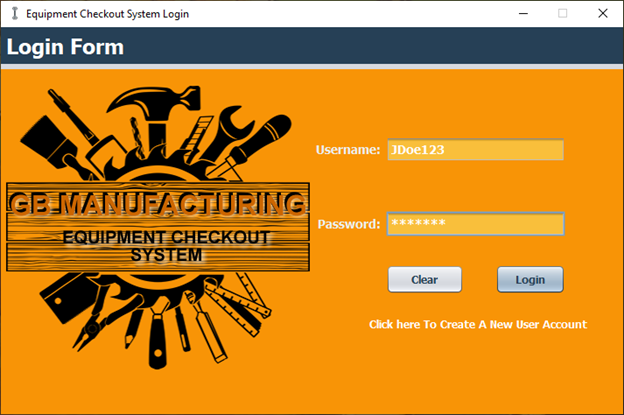

## Employee Interface

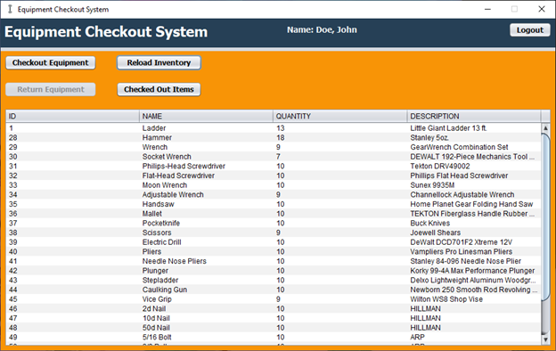

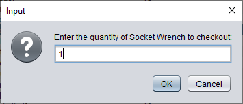

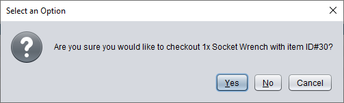

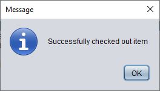

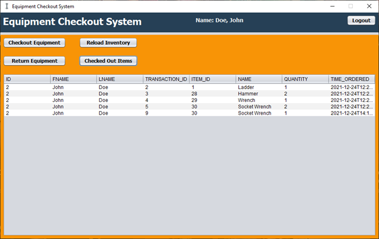

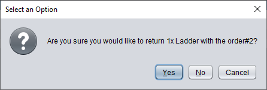

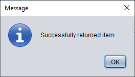

## Manager Interface

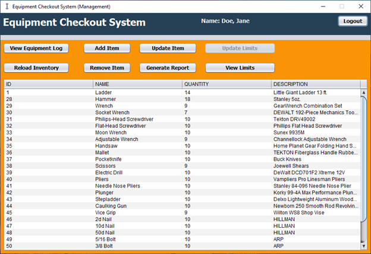

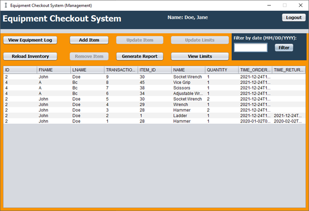

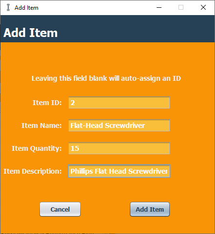

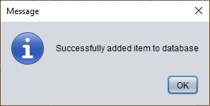

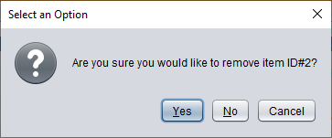

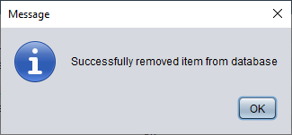

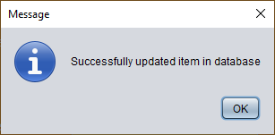

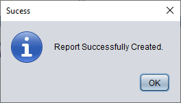

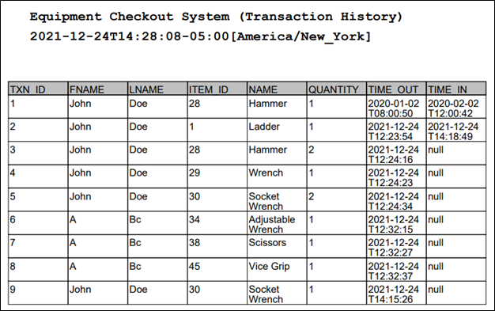

## Data Model

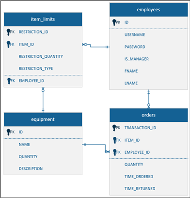

## Class Diagram

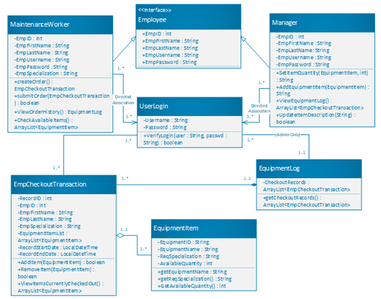
