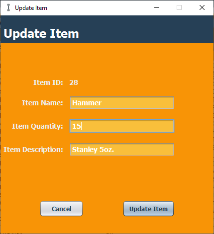

<!-- Main Title -->
# InventoryManagement_ECS

<!-- ABOUT THE PROJECT -->
## About The Project

The Equipment Checkout System uses the Java programming language and Swing application framework to track an organizations maintenance equipment.
In general the program is used to:
* Track when employees checkout/return maintenance equipment items.
* Provide detailed information such as the item, employee, time, date, and quantity.
* Ability to generate a PDF version of the transaction history and can be filtered by date.

## Employee Interface Capabilities

The following functionality is present when using the application after registering as an employee user.
* Checkout equipment items by selecting an item column from the table model and using the checkout button.
* View the equipment items currently checked out and return equipment from the table model in the same manner as checking out.
* Reload inventory list to provide an accurate description of what items are available.
* Logout functionality that will return the user to the login frame.

## Manager Interface Capabilities

The following functionality is present when using the application after registering as a manager user.
* View the equipment transaction log for all employees which can further be filtered by date.
* Add, remove, and update equipment items from the MySQL database.
* Update and view equipment item limits on an individual employee and global scale.
* Generate a PDF report for all equipment item transactions.
* Reload inventory list to provide an accurate description of what items are available.
* Logout functionality that will return the user to the login frame.

<!-- Screenshots -->
## Sample Screenshots and Further Information

### Login Form

* When the application is executed the login form is presented to the user.
* New users can click the link below the buttons to create an account.
* The clear button will remove all information currently present in the text fields.
* The login button or Enter key can be pressed to login to the system.

### Employee Interface

The main employee interface where staff members can:
* Checkout equipment items
* Return equipment items
* View currently checked out equipment items
* Refresh inventory

#### Checking out an item
* Input prompt for the user to enter the amount of items required.
* Confirmation prompt to ensure the correct amount was entered.
* Success prompt notifying the user that changes have been made to the system reflecting their equipment checkout.

#### Viewing currently checked out equipment
* Displays equipment in the possession of the user currently logged into the system.

#### Returning an item
* Confirmation prompt to ensure the user would like to return the selected equipment items.
* Success prompt notifying the user that changes have been made to the system reflecting the returned equipment.

### Manager Interface

The main manager interface where management staff can:
* View the equipment transaction log
* Add, remove, and update equipment items
* Update and view equipment item limits
* Generate a PDF report for all transactions
* Reload inventory list

#### Viewing equipment log:
* View the equipment transaction log for all staff members.

#### Adding an item to the system:
* Allows management staff too add new equipment items to the database.
* Success prompt notifying the user that the item has been added to the system.

#### Removing an item from the system:
* 'Remove Item' button after an equipment item is selected from the current inventory listing.
* Confirmation prompt to ensure the user would like to remove the selected equipment item from the system.
* Success prompt notifying the user that the item has been removed to the system.

#### Updating an existing item in the system:
* Allows management staff modify equipment item information in the database.
* Success prompt notifying the user that the item has been modified in the system.

#### Adding item limit restrictions:
* Allows management staff to edit current item limits on a global and individual scale.
* When adding or updating item limits for a specific employee the manager can use the search funcitonality.
* The search function requires a first name, last name, or username that will be used to query the database.
* The manager can then select from the listing below and use the select button to auto complete the Employee ID form information.
* Buttons will be enabled/disabled depending on the information entered in the form.

#### Generating and view PDF reports:
* Success prompt notifying the user that the report has been generated.
* Demonstraction report displaying sample employee transaction details.

## Data Model

## Class Diagram

* Prototype class diagram developed during design phase of SDLC.

